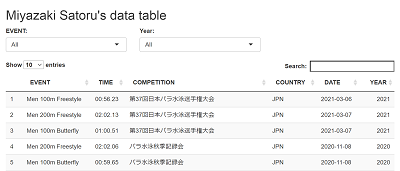

###  [お知らせ](./log.html)  

####  2021-03-06
>  今日から第37回日本パラ水泳選手権大会です。  

[お知らせはこちら](./log.html)    
 
* * *

### [プロフィール](./about.html)  

        
*   所属 [あいおいニッセイ同和損害保険株式会社](http://www.challenge-support.com/)
*   北海道出身
*   [日本知的障害者水泳連盟](https://jsfpid.com/)強化指定選手
*   [English: https://www.paralympic.org/satoru-miyazaki](https://www.paralympic.org/satoru-miyazaki)  

[プロフィールはこちら](./about.html)   

* * *

### [競技活動の記録](./news.html)  

[競技活動の記録はこちら](./news.html)  

* * *

### データベース

>  [データベース デモ版](https://famimiya.shinyapps.io/demo/)  
>  
>  ▼サンプル画像
>  
> 
>  期間: 2019-03-03 - 2021-03-07
>  

